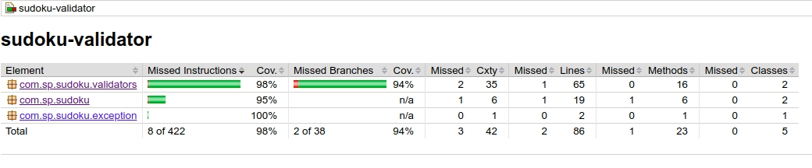

# Sudoku Validator 
Sudoku Validator is a command line java application that validates a sudoku which is given in a csv (.csv or .txt) file. In case of a valid Sudoku the validator returns **0** and non-zero for an invalid one.
 
## Sudoku validation rules
A given Sudoku is **valid** if all of the following rules are fulfilled.
1. Each row must contain the digits 1-9 without repetition
1. Each column must contain the digits 1-9 without repetition.
1. Each of the 9 3x3 sub-boxes of the grid must contain the digits 1-9 without repetition.
1. The Sudoku board could be partially filled, where empty cells can be filled with an **empty character (space)** (or no-character).

### Example of a valid Sudoku
```csv
 , , ,9,1,7, , ,8
 , ,5, , ,4, , ,2
 , , , , , ,4,9,
6,5, ,3, ,1, ,2,4
1,4, ,8, ,9, ,6,3
8,3, ,4, ,5, ,1,9
 ,7,8, , , , , ,
4, , ,5, , ,6, ,
5, , ,7,4,8, , ,
```

### Example of an invalid Sudoku (includes duplicate in first row)
```csv
9, , ,9,1,7, , ,8
 , ,5, , ,4, , ,2
 , , , , , ,4,9,
6,5, ,3, ,1, ,2,4
1,4, ,8, ,9, ,6,3
8,3, ,4, ,5, ,1,9
 ,7,8, , , , , ,
4, , ,5, , ,6, ,
5, , ,7,4,8, , ,
```

## Project Structure
| Directory           | Description     |
| ------------------- |:---------------:|
|./run                | Run script (validateSudoku.bat)|
|./src                | The source code.|
  
## How to compile
Sudoku Validator is a maven project and can be compiled by running the following:
```bash
mvn clean compile
```

## How to build
Sudoku Validator is a maven project and can be built by running the following:
```bash
mvn clean package
```
By building the project we can find an executable jar file in ```./target/sudoku-validator-***-.jar``` as well as the required libraries in ```./target/libs/```.

## How to run the application
Sudoku validator can be ran in Windows OS by running from the run dir the following:
```cmd
validateSudoku.bat givenSudoku.txt
```

## How to generate the test-coverage report for the unit tests
In order to generate the test-coverage report you can run the following:
```bash
mvn clean test
```
The generated reports can be found in ```./target/site/jacoco/index.html```.
eg. 

## Out of Scope
It is out of scope the check if a given sudoku is **solvable** or not. Solvable means that the given sudoku has one and only one solution.